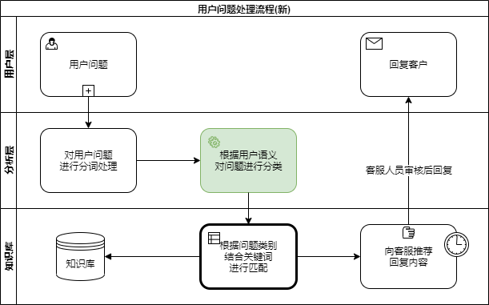

# 基于LSTM实现客服问题分类

[TOC]

## 1. 问题定义

### 1.1 项目背景

本人所在企业拥有庞大的客服团队，每天需要处理5000+客户的各种问题。如何提高客服团队的工作效率、提升客服的工作品质，为客户提供快速、及时、专业、到位的服务，成为公司提升客户服务体验，增进业务数据，树立市场口碑，建立行业壁垒的重要课题。

客服团队的传统管理哲学主要靠3大核心体系：**培训**、**激励**、**质检**。在互联网时代，尤其是人工智能时代，传统的管理思想已经明显落后且生产力低下，主要体现在：

* 培训需要投入大量培训资源，客服人员成熟时间周期长；
* 激励往往只画饼、定目标，很少提供达成目标的工具；
* 质检同样需要投入大量人力，且纠偏不及时，属于亡羊补牢。

现代客服团队管理强调的是--**标准化**。

通过将客服问题标准化，降低培训的难度和客服人员成熟的周期；标准化后，可以为客服人员提供更加便捷高效的客服工具，提升工作效能；有了标准化的客服话术，质检也可以实现自动化，更加实时有效，且节省人力。

因此，一套基于业务场景的客服问题知识图谱是提升企业客服品效的核心。公司希望利用人工智能为客服团队打造一套智能辅助系统，在理解客户问题的基础上，为客服人员推荐回应话术。

### 1.2 问题描述

实现智能客服的前提是首先理解客户的问题，然后根据客户所问的问题在知识库或知识图谱中匹配回应内容。所以如何准确理解客户问题是实现智能客服的核心。

公司的客服知识库是基于客户的问题类型进行分类组织的，经过2年的沉淀，已经形成了【知识类目和条数】。之前对客户问题的分类采用的是粗暴的关键字发现，从客户的问题中提取关键字，然后去匹配问题类型。（流程见图1）

图1：基于关键词匹配的问题响应流程

上面流程最大的问题在红框标出的部分。

**首先**，关键词往往不能反映客户问题的本意。汉语博大精深，相同词汇组成的句子如果结构或标点符号不同，意思可能大相径庭。比如：

> 女人没有了，男人就恐慌了。
>
> 女人没有了男人，就恐慌了。

这两个句子里的文字完全一样，但标点符号不同，表达的意思截然相反。这种情况，通过关键字无法准确识别客户的真实意图，造成回复驴唇不对马嘴。

**其次**，客户的同一问题表达方式会多种多样，提取的关键词也会非常多变，系统不可能穷尽所有关键词情况。比如客户问：

> 我是美国人，我可以投保吗？
>
> 我是汤加人，我可以投保吗？

其实这两个问题是同一类问题，但是提取的关键字第一个是`美国`，第二个是`汤加`。如果系统没有对`汤加`做处理，则对第二个问题就没办法很好的回答。

**最后**，关键词匹配丢失了上下文，对于客户的连续问题无法很好的处理。比如：

> 我36岁，可以投保这个产品吗？
>
> 那我爸爸呢？

对第二个问题，只能提取到`爸爸`一个关键词，系统完全不知如何回应。

尽管可以通过很多算法和技巧优化上面的问题，但是整体在实际应用中，匹配准确率只有**47%**，无法满足商业应用的要求。理想的解决方案就是利用人工智能，让机器真的能够理解客户问题的语义，然后根据对问题语义进行分类，从而提高匹配的准确率。理想中的流程如下图：

图2：基于语义理解的问题响应流程

新旧流程的区别就在绿框部分，需要训练一个模型能够理解用户输入文本的语义，并将其分类到一个问题分类上。本文下面的内容将围绕这个问题，利用公司已经标记好的客服问题数据集，采用深度学习的方法，训练一个客服问题分类模型。

### 1.3 评估指标

本项目的目的是将用户提问的问题准确的匹配到一个问题分类上，所以模型的评估指标是**分类的准确率**，即：分类正确的样本数/样本总数
$$
Acc = \frac{N_{correct}}{N_{total}}
$$
旧有的基于关键词匹配的准确率只有**47%**，为了满足商业应用需要，期望技术深度学习训练出的模型在测试集和验证集上的准确率都能在**90%**以上。

由于训练结果要用于商业使用上，所以还需要考虑性能和部署，希望训练好的模型对客户问题的识别耗时<1s；为了满足规模使用，应对客户问题峰值，整个解决方案需要支持迁移学习和分布式部署。

## 2. 问题分析

### 2.1 数据集获取

### 2.2 数据探索

### 2.3 算法选型

文本分类有很多的实现算法，从大类划分有2大类：

* 基于传统机器学习的文本分类，如SVM、朴素贝叶斯等
* 基于深度学习的文本分类，如TextCNN, LSTM...

#### 2.3.1 传统机器学习方法

传统机器学习方法是90年代后期，伴随着统计学习方法的发展和互联网的兴起，发展起来的经典机器学习方法。传统机器学习方法解决问题的思路是**人工特征工程**+**浅层的分类模型**。就文本分类问题而言，整个过程分解为特征提取和分类器构建两部分（见图3）。

图3：传统机器学习方法解决文本分类流程

#### 2.3.2 深度学习方法

传统机器学习方法主要问题的文本表示是高维度高稀疏的，特征表达能力很弱，而且神经网络很不擅长对此类数据的处理；此外人工特征工程需要人工介入，成本很高。近几年随着深度学习的发展，深度学习算法在文本表示和特征表达方面取得了巨大突破，利用RNN提取句子的关键语义信息，再利用CNN提取文本的特征，去掉繁杂的人工特征工程，最后根据特征进行分类。

图4：深度学习方法解决文本分类流程

#### 2.3.3 算法选择

通过上面的介绍，我们可以发现深度学习方法比传统机器学习方法具有明显优势。

**首先**，深度学习方法不需要人工手动的提取文本的特征，它可以自动的获取基础特征并组合为高级的特征，训练模型获得文本特征与目标分类之间的关系，省去了使用TF-IDF等提取句子的关键词构建特征工程的过程。

**其次**，相比传统模型而言，深度学习可以更好的利用词序的特征，而RNN（LSTM）则可以利用更长的词序和上下文语义。

**最后**，考虑训练效率和最终上线部署实施，深度学习方法比传统方法具有优势。利用Tensorflow框架可以利用GPU加速训练过程，并且训练出的模型更容易分布式部署。

综上，在模型算法上采用深度学习方法，利用LSTM+CNN进行文本分类；实现上使用Tensorflow开发和部署。

## 3. 模型实现

## 4. 模型效果

## 5. 结论