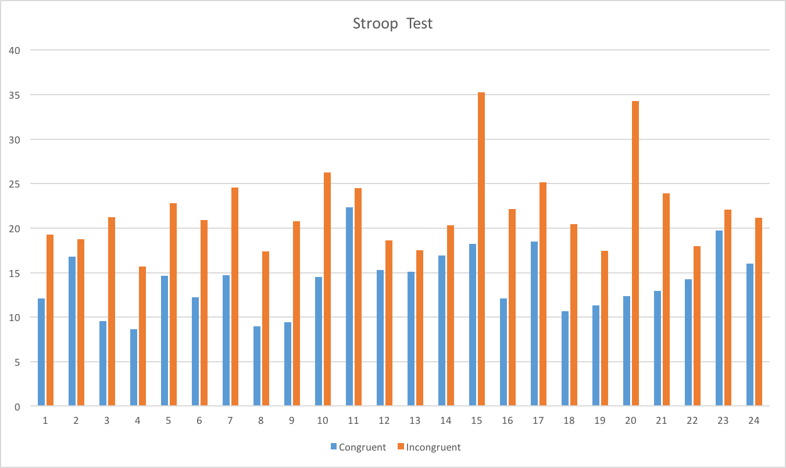
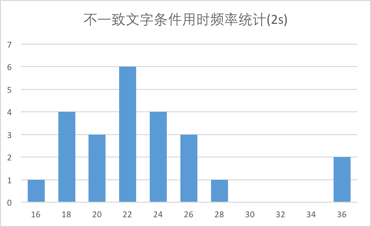
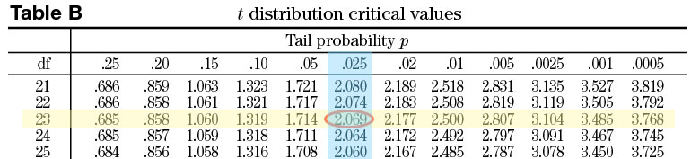

<h2 align='center'>检验心理学现象</h2>

### 问题 1：确认试验中的变量

自变量：文字与打印颜色的一致性

因变量：说出墨色名称的时间

### 问题 2a：建立假设

$\mu_{con}$：表示一致文字条件下读出墨色名称的时间均值

$\mu_{incon}$：表示不一致文字条件下读出墨色名称的时间均值

零假设($H_{0}$)：$\mu_{con} = \mu_{incon}$，表示一致文字条件下和不一致文字条件下读出墨色名称的时间相同

对立假设($H_{A}$)：$\mu_{con} \not= \mu_{incon}$，表示一致文字条件下和不一致文字条件下读出墨色名称的时间不相同

### 问题 2b：建立统计检验

由于样本数量较少（n=24）并且总体标准差$\sigma$未知，因此选择 **t 检验** ；

实验数据是两组相同实验对象在不同条件下的测试结果，因此选用**配对 t 检验**。

因为对立假设为$\mu_{con} \not= \mu_{incon}$，所以选择**双尾检验**， 选用**$\alpha = 0.05$**的统计显著水平

### 问题 3：报告描述性统计分析

##### 均值

$ \bar x_{con} = \frac{12.079
+16.791
+9.564
+8.63
+14.669
+12.238
+14.692
+8.987
+9.401
+14.48
+22.328
+15.298
+15.073
+16.929
+18.2
+12.13
+18.495
+10.639
+11.344
+12.369
+12.944
+14.233
+19.71
+16.004}{24} = 14.051$ 

$ \bar x_{incon} = \frac{19.278
+18.741
+21.214
+15.687
+22.803
+20.878
+24.572
+17.394
+20.762
+26.282
+24.524
+18.644
+17.51
+20.33
+35.255
+22.158
+25.139
+20.429
+17.425
+34.288
+23.894
+17.96
+22.058
+21.157}{24} = 22.016$ 

##### 中位值

先对数据按照从大到小排序。由于样本数量为24，是偶数，所以取第12，13数据的平均值。

$median_{con} = \frac{14.233+14.48}{2} = 14.3565$

$median_{incon} = \frac{20.878+21.157}{2} = 21.0175$

##### 标准差

计算过程见[stroopdata.csv](./stroopdata.csv)

样本标准差$S = \sqrt{ \frac{1}{n-1} \sum_{i=1}^n (x_i -\bar x)^2}$

$S_{con} = 3.559$ （E列和单元格B27）

$S_{incon} = 4.797$ （F列和单元格C27）

### 问题 4：绘制数据图

从上图可以看出：不一致文字条件下，读出墨色名称的时间全部都高于一致文字条件下的阅读时间。

从上面2张图可以看出：统计结果基本服从正态分布。

### 问题 5：执行统计检验并解读结果

计算过程见[stroopdata.csv](./stroopdata.csv)

首先计算差异均值：$\bar {diff} = \frac{\sum_{i=1}^n (y_i-x_i)}{n} = 7.965$ (单元格D26)

计算差异的标准差：$S_{diff} = \sqrt{ \frac{1}{n-1} \sum_{i=1}^n (diff_i -\bar {diff})^2} = 4.865$ (G列和单元格D27)

计算均值标准误差：$SEM = \frac{S}{\sqrt{n}} = \frac{4.865}{\sqrt{24}} = 0.993$ （单元格D28）

计算t值：$t = \frac{\bar {diff}}{SEM} = \frac{7.965}{0.993} = 8.021$（单元格D29）

统计显著水平 $\alpha = .05$，自由度 $df=23$，执行双尾测试，查表得：$t_{critical} = 2.069$。

$t = 8.021$，$t>t_{critical}$，处于临界区内；$p < .05$。

所以该结果是统计显著的，应该**拒绝零假设**。

### 问题 6：更深入探索和扩展调查

Cohen's $d = \frac{\bar {diff}}{S_{diff}} = \frac{7.965}{4.865} = 1.637$ （单元格D30），表明不一致文字条件的结果和一致文字条件的结果相差1.637个标准偏差，差异显著。

$r^2 = \frac{t^2}{t^2+df} = \frac{8.021^2}{8.021^2+23} = 0.7366$ (单元格D31), 说明结果差异有73.66%是由于不一致文字条件引起的。

